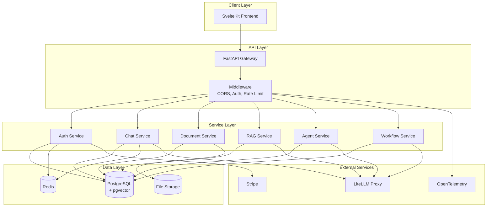
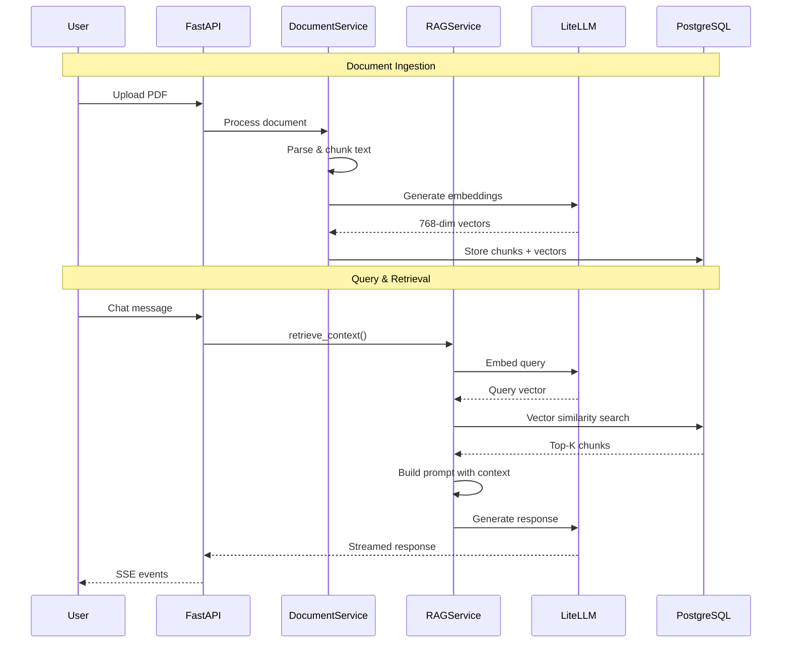
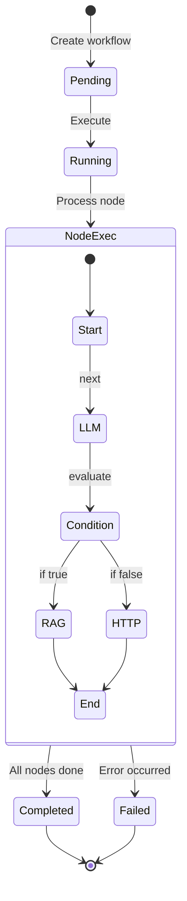

# Architecture Documentation

## System Architecture

```
┌─────────────────────────────────────────────────────────────────────────────┐
│                              CLIENT LAYER                                    │
├─────────────────────────────────────────────────────────────────────────────┤
│  ┌─────────────────────────────────────────────────────────────────────┐   │
│  │                    SvelteKit Frontend                                │   │
│  │  ┌──────────┐  ┌──────────┐  ┌──────────┐  ┌──────────────────────┐│   │
│  │  │  Pages   │  │  Stores  │  │API Client│  │   UI Components      ││   │
│  │  │(routes/) │  │(.svelte  │  │(lib/api/)│  │   (shadcn-svelte)    ││   │
│  │  │          │  │  .ts)    │  │          │  │                      ││   │
│  │  └──────────┘  └──────────┘  └──────────┘  └──────────────────────┘│   │
│  └─────────────────────────────────────────────────────────────────────┘   │
└──────────────────────────────────┬──────────────────────────────────────────┘
                                   │ HTTP/REST + SSE
┌──────────────────────────────────▼──────────────────────────────────────────┐
│                              API LAYER                                       │
├─────────────────────────────────────────────────────────────────────────────┤
│  ┌─────────────────────────────────────────────────────────────────────┐   │
│  │                      FastAPI Application                             │   │
│  │                                                                      │   │
│  │  ┌────────────────────────────────────────────────────────────────┐ │   │
│  │  │                        Middleware                               │ │   │
│  │  │  ┌──────────┐  ┌──────────┐  ┌──────────┐  ┌──────────────────┐│ │   │
│  │  │  │   CORS   │  │   Auth   │  │  Rate    │  │   OpenTelemetry  ││ │   │
│  │  │  │          │  │  (JWT)   │  │  Limit   │  │   (Tracing)      ││ │   │
│  │  │  └──────────┘  └──────────┘  └──────────┘  └──────────────────┘│ │   │
│  │  └────────────────────────────────────────────────────────────────┘ │   │
│  │                                                                      │   │
│  │  ┌────────────────────────────────────────────────────────────────┐ │   │
│  │  │                         Routes                                  │ │   │
│  │  │  ┌────────┐ ┌────────┐ ┌────────┐ ┌────────┐ ┌──────────────┐ │ │   │
│  │  │  │  Auth  │ │  Chat  │ │  Docs  │ │ Agents │ │  Workflows   │ │ │   │
│  │  │  └────────┘ └────────┘ └────────┘ └────────┘ └──────────────┘ │ │   │
│  │  │  ┌────────┐ ┌────────┐ ┌────────┐ ┌────────┐ ┌──────────────┐ │ │   │
│  │  │  │Billing │ │ Admin  │ │Projects│ │ Health │ │  Webhooks    │ │ │   │
│  │  │  └────────┘ └────────┘ └────────┘ └────────┘ └──────────────┘ │ │   │
│  │  └────────────────────────────────────────────────────────────────┘ │   │
│  └─────────────────────────────────────────────────────────────────────┘   │
└──────────────────────────────────┬──────────────────────────────────────────┘
                                   │
┌──────────────────────────────────▼──────────────────────────────────────────┐
│                            SERVICE LAYER                                     │
├─────────────────────────────────────────────────────────────────────────────┤
│  ┌─────────────────────────────────────────────────────────────────────┐   │
│  │                        Business Services                             │   │
│  │                                                                      │   │
│  │  ┌──────────────┐  ┌──────────────┐  ┌──────────────┐              │   │
│  │  │ AuthService  │  │ ChatService  │  │ DocumentSvc  │              │   │
│  │  │ - register   │  │ - chat       │  │ - upload     │              │   │
│  │  │ - login      │  │ - stream     │  │ - process    │              │   │
│  │  │ - refresh    │  │ - history    │  │ - chunk      │              │   │
│  │  └──────────────┘  └──────────────┘  └──────────────┘              │   │
│  │                                                                      │   │
│  │  ┌──────────────┐  ┌──────────────┐  ┌──────────────┐              │   │
│  │  │ RAGService   │  │ AgentService │  │ WorkflowSvc  │              │   │
│  │  │ - embed      │  │ - create     │  │ - execute    │              │   │
│  │  │ - retrieve   │  │ - configure  │  │ - stream     │              │   │
│  │  │ - search     │  │ - link_docs  │  │ - template   │              │   │
│  │  └──────────────┘  └──────────────┘  └──────────────┘              │   │
│  │                                                                      │   │
│  │  ┌──────────────┐  ┌──────────────┐  ┌──────────────┐              │   │
│  │  │BillingService│  │ UsageService │  │ AuditService │              │   │
│  │  │ - checkout   │  │ - track      │  │ - log        │              │   │
│  │  │ - portal     │  │ - summarize  │  │ - query      │              │   │
│  │  │ - webhooks   │  │ - limits     │  │ - export     │              │   │
│  │  └──────────────┘  └──────────────┘  └──────────────┘              │   │
│  └─────────────────────────────────────────────────────────────────────┘   │
└──────────────────────────────────┬──────────────────────────────────────────┘
                                   │
┌──────────────────────────────────▼──────────────────────────────────────────┐
│                             DATA LAYER                                       │
├─────────────────────────────────────────────────────────────────────────────┤
│                                                                              │
│  ┌────────────────────┐  ┌────────────────────┐  ┌────────────────────┐    │
│  │   PostgreSQL 16    │  │       Redis        │  │     File Store     │    │
│  │    + pgvector      │  │                    │  │                    │    │
│  │                    │  │  - Rate limiting   │  │  - Uploaded docs   │    │
│  │  - Users           │  │  - Session cache   │  │  - Processed files │    │
│  │  - Documents       │  │  - Temp data       │  │                    │    │
│  │  - Chunks (vectors)│  │                    │  │                    │    │
│  │  - Conversations   │  │                    │  │                    │    │
│  │  - Agents          │  │                    │  │                    │    │
│  │  - Workflows       │  │                    │  │                    │    │
│  │  - Subscriptions   │  │                    │  │                    │    │
│  │  - Audit logs      │  │                    │  │                    │    │
│  │                    │  │                    │  │                    │    │
│  └────────────────────┘  └────────────────────┘  └────────────────────┘    │
│                                                                              │
└──────────────────────────────────┬──────────────────────────────────────────┘
                                   │
┌──────────────────────────────────▼──────────────────────────────────────────┐
│                          EXTERNAL SERVICES                                   │
├─────────────────────────────────────────────────────────────────────────────┤
│                                                                              │
│  ┌────────────────────┐  ┌────────────────────┐  ┌────────────────────┐    │
│  │      LiteLLM       │  │       Stripe       │  │    OpenTelemetry   │    │
│  │      Proxy         │  │                    │  │      Collector     │    │
│  │                    │  │  - Payments        │  │                    │    │
│  │  - OpenAI          │  │  - Subscriptions   │  │  - Traces          │    │
│  │  - Anthropic       │  │  - Invoices        │  │  - Metrics         │    │
│  │  - Google Gemini   │  │  - Webhooks        │  │  - Logs            │    │
│  │                    │  │                    │  │                    │    │
│  │                    │  │                    │  │                    │    │
│  └────────────────────┘  └────────────────────┘  └────────────────────┘    │
│                                                                              │
└─────────────────────────────────────────────────────────────────────────────┘
```

## RAG Pipeline Flow

```
┌─────────────────────────────────────────────────────────────────────────────┐
│                         DOCUMENT INGESTION                                   │
└─────────────────────────────────────────────────────────────────────────────┘

     ┌──────────┐     ┌──────────┐     ┌──────────┐     ┌──────────┐
     │  Upload  │────▶│  Parse   │────▶│  Chunk   │────▶│  Embed   │
     │  File    │     │  Content │     │  Text    │     │  Vectors │
     └──────────┘     └──────────┘     └──────────┘     └──────────┘
          │                │                │                │
          ▼                ▼                ▼                ▼
     ┌──────────┐     ┌──────────┐     ┌──────────┐     ┌──────────┐
     │ PDF,DOCX │     │ Extract  │     │ 512-1024 │     │ 768-dim  │
     │ TXT,MD   │     │ Text     │     │ tokens   │     │ vectors  │
     │ CSV      │     │          │     │ overlap  │     │          │
     └──────────┘     └──────────┘     └──────────┘     └──────────┘
                                                              │
                                                              ▼
                                                        ┌──────────┐
                                                        │ pgvector │
                                                        │ Storage  │
                                                        └──────────┘

┌─────────────────────────────────────────────────────────────────────────────┐
│                            QUERY RETRIEVAL                                   │
└─────────────────────────────────────────────────────────────────────────────┘

     ┌──────────┐     ┌──────────┐     ┌──────────┐     ┌──────────┐
     │  User    │────▶│  Embed   │────▶│  Vector  │────▶│  Build   │
     │  Query   │     │  Query   │     │  Search  │     │  Context │
     └──────────┘     └──────────┘     └──────────┘     └──────────┘
                           │                │                │
                           ▼                ▼                ▼
                      ┌──────────┐     ┌──────────┐     ┌──────────┐
                      │ 768-dim  │     │ Top-K    │     │ Ranked   │
                      │ vector   │     │ Cosine   │     │ Chunks + │
                      │          │     │ Similar  │     │ Sources  │
                      └──────────┘     └──────────┘     └──────────┘
                                                              │
                                                              ▼
                                                        ┌──────────┐
                                                        │   LLM    │
                                                        │ Response │
                                                        │ + Sources│
                                                        └──────────┘
```

## Workflow Execution Engine

```
┌─────────────────────────────────────────────────────────────────────────────┐
│                         WORKFLOW BUILDER                                     │
└─────────────────────────────────────────────────────────────────────────────┘

                    ┌─────────────────────────────────────┐
                    │         Visual Canvas               │
                    │         (XYFlow)                    │
                    │                                     │
                    │    ┌─────┐      ┌─────┐            │
                    │    │Start│─────▶│ LLM │            │
                    │    └─────┘      └──┬──┘            │
                    │                    │               │
                    │              ┌─────▼─────┐         │
                    │              │ Condition │         │
                    │              └─────┬─────┘         │
                    │             ┌──────┴──────┐        │
                    │             ▼             ▼        │
                    │         ┌─────┐       ┌─────┐     │
                    │         │ RAG │       │HTTP │     │
                    │         └──┬──┘       └──┬──┘     │
                    │            └──────┬──────┘        │
                    │                   ▼               │
                    │               ┌─────┐             │
                    │               │ End │             │
                    │               └─────┘             │
                    └─────────────────────────────────────┘

┌─────────────────────────────────────────────────────────────────────────────┐
│                       EXECUTION ENGINE                                       │
└─────────────────────────────────────────────────────────────────────────────┘

    ┌──────────────────────────────────────────────────────────────────┐
    │                    Node Type Handlers                             │
    │                                                                   │
    │  ┌─────────┐ ┌─────────┐ ┌─────────┐ ┌─────────┐ ┌─────────┐   │
    │  │  Start  │ │   LLM   │ │  Agent  │ │   RAG   │ │  Tool   │   │
    │  └─────────┘ └─────────┘ └─────────┘ └─────────┘ └─────────┘   │
    │                                                                   │
    │  ┌─────────┐ ┌─────────┐ ┌─────────┐ ┌─────────┐ ┌─────────┐   │
    │  │Condition│ │  Loop   │ │  HTTP   │ │ Custom  │ │   End   │   │
    │  └─────────┘ └─────────┘ └─────────┘ └─────────┘ └─────────┘   │
    └──────────────────────────────────────────────────────────────────┘

                                    │
                                    ▼

    ┌──────────────────────────────────────────────────────────────────┐
    │                   Execution Flow                                  │
    │                                                                   │
    │   Parse Graph ──▶ Topological Sort ──▶ Execute Nodes             │
    │                                              │                    │
    │                                              ▼                    │
    │                                    ┌─────────────────┐           │
    │                                    │  SSE Streaming  │           │
    │                                    │  Event Updates  │           │
    │                                    └─────────────────┘           │
    └──────────────────────────────────────────────────────────────────┘
```

## Authentication Flow

```
┌─────────────────────────────────────────────────────────────────────────────┐
│                          JWT AUTHENTICATION                                  │
└─────────────────────────────────────────────────────────────────────────────┘

    ┌────────────┐                                      ┌────────────┐
    │   Client   │                                      │   Server   │
    └─────┬──────┘                                      └─────┬──────┘
          │                                                   │
          │  POST /auth/login {email, password}               │
          │──────────────────────────────────────────────────▶│
          │                                                   │
          │                                    ┌──────────────┴──────────────┐
          │                                    │ 1. Validate credentials      │
          │                                    │ 2. bcrypt.verify(password)   │
          │                                    │ 3. Generate JWT tokens        │
          │                                    │    - access_token (30 min)   │
          │                                    │    - refresh_token (7 days)  │
          │                                    └──────────────┬──────────────┘
          │                                                   │
          │  {access_token, refresh_token}                    │
          │◀──────────────────────────────────────────────────│
          │                                                   │
          │  GET /api/resource                                │
          │  Authorization: Bearer <access_token>             │
          │──────────────────────────────────────────────────▶│
          │                                    ┌──────────────┴──────────────┐
          │                                    │ 1. Decode & verify JWT       │
          │                                    │ 2. Check expiration          │
          │                                    │ 3. Load user from DB         │
          │                                    └──────────────┬──────────────┘
          │  {data}                                           │
          │◀──────────────────────────────────────────────────│
          │                                                   │
          │  POST /auth/refresh                               │
          │  {refresh_token}                                  │
          │──────────────────────────────────────────────────▶│
          │                                                   │
          │  {new_access_token}                               │
          │◀──────────────────────────────────────────────────│
          │                                                   │
```

## Database Schema (Simplified)

```
┌─────────────────────────────────────────────────────────────────────────────┐
│                           ENTITY RELATIONSHIPS                               │
└─────────────────────────────────────────────────────────────────────────────┘

    ┌──────────────┐
    │     User     │
    │──────────────│
    │ id           │
    │ email        │
    │ password_hash│
    │ tier         │
    │ is_superuser │
    └──────┬───────┘
           │
           │ 1:N
           │
    ┌──────┴──────────────────────────────────────────────────┐
    │                         │                                │
    ▼                         ▼                                ▼
┌──────────┐           ┌──────────────┐               ┌──────────────┐
│ Project  │           │ Conversation │               │ Subscription │
│──────────│           │──────────────│               │──────────────│
│ id       │           │ id           │               │ id           │
│ name     │           │ title        │               │ stripe_id    │
│ user_id  │           │ user_id      │               │ plan_id      │
└────┬─────┘           │ project_id   │               │ status       │
     │                 └──────┬───────┘               └──────────────┘
     │ 1:N                    │ 1:N
     │                        │
     ▼                        ▼
┌──────────────┐       ┌──────────────┐
│   Document   │       │   Message    │
│──────────────│       │──────────────│
│ id           │       │ id           │
│ filename     │       │ role         │
│ status       │       │ content      │
│ project_id   │       │ conversation │
└──────┬───────┘       └──────────────┘
       │ 1:N
       │
       ▼
┌──────────────────┐
│  DocumentChunk   │
│──────────────────│
│ id               │
│ content          │
│ embedding (768d) │◀──── pgvector
│ document_id      │
└──────────────────┘


┌──────────────┐           ┌──────────────┐
│    Agent     │           │   Workflow   │
│──────────────│           │──────────────│
│ id           │           │ id           │
│ name         │           │ name         │
│ system_prompt│           │ config (JSON)│
│ tools        │           │ is_published │
│ user_id      │           │ user_id      │
│ is_system    │           └──────┬───────┘
└──────────────┘                  │ 1:N
                                  │
                                  ▼
                          ┌────────────────────┐
                          │ WorkflowExecution  │
                          │────────────────────│
                          │ id                 │
                          │ status             │
                          │ input              │
                          │ output             │
                          │ execution_history  │
                          └────────────────────┘
```

## Deployment Architecture

```
┌─────────────────────────────────────────────────────────────────────────────┐
│                         DOCKER COMPOSE SETUP                                 │
└─────────────────────────────────────────────────────────────────────────────┘

    ┌─────────────────────────────────────────────────────────────────────┐
    │                         app-network                                  │
    │                                                                      │
    │   ┌─────────────────┐     ┌─────────────────┐                       │
    │   │    Frontend     │     │     Backend     │                       │
    │   │   (Optional)    │     │    FastAPI      │                       │
    │   │   Port: 5173    │     │   Port: 8000    │                       │
    │   └─────────────────┘     └────────┬────────┘                       │
    │                                    │                                 │
    │          ┌─────────────────────────┼─────────────────────────┐      │
    │          │                         │                         │      │
    │          ▼                         ▼                         ▼      │
    │   ┌─────────────┐          ┌─────────────┐          ┌─────────────┐│
    │   │ PostgreSQL  │          │    Redis    │          │   LiteLLM   ││
    │   │   :5432     │          │    :6379    │          │    :4000    ││
    │   │             │          │             │          │             ││
    │   │  + pgvector │          │             │          │  + Postgres ││
    │   │             │          │             │          │    :5433    ││
    │   └─────────────┘          └─────────────┘          └─────────────┘│
    │                                                                      │
    └─────────────────────────────────────────────────────────────────────┘

    ┌─────────────────────────────────────────────────────────────────────┐
    │                    MONITORING (Optional Profile)                     │
    │                                                                      │
    │   ┌───────────────────────┐     ┌───────────────────────┐          │
    │   │  OpenTelemetry        │     │      Jaeger           │          │
    │   │  Collector            │────▶│      :16686           │          │
    │   │  :4317 (gRPC)         │     │      (Traces UI)      │          │
    │   └───────────────────────┘     └───────────────────────┘          │
    │                                                                      │
    └─────────────────────────────────────────────────────────────────────┘
```

## Security Layers

```
┌─────────────────────────────────────────────────────────────────────────────┐
│                          SECURITY ARCHITECTURE                               │
└─────────────────────────────────────────────────────────────────────────────┘

    Request Flow:

    ┌───────┐     ┌───────┐     ┌───────┐     ┌───────┐     ┌───────┐
    │ HTTPS │────▶│ CORS  │────▶│ Rate  │────▶│  JWT  │────▶│ Route │
    │       │     │ Check │     │ Limit │     │ Auth  │     │Handler│
    └───────┘     └───────┘     └───────┘     └───────┘     └───────┘

    Rate Limiting:
    ┌────────────────────────────────────────────────────────────────────┐
    │  Endpoint              │  Limit                                    │
    │────────────────────────┼───────────────────────────────────────────│
    │  /auth/login           │  5 requests/minute                        │
    │  /auth/register        │  3 requests/minute                        │
    │  /api/* (default)      │  60 requests/minute                       │
    │  /chat/stream          │  30 requests/minute                       │
    └────────────────────────────────────────────────────────────────────┘

    Data Protection:
    ┌────────────────────────────────────────────────────────────────────┐
    │  Layer                 │  Protection                               │
    │────────────────────────┼───────────────────────────────────────────│
    │  Password              │  bcrypt hashing with salt                 │
    │  JWT                   │  HS256 signing, 32-char min secret        │
    │  Database              │  Parameterized queries (SQLAlchemy)       │
    │  API                   │  Pydantic input validation                │
    │  Files                 │  Type validation, size limits             │
    └────────────────────────────────────────────────────────────────────┘
```

## Mermaid Diagrams

### System Overview (for GitHub/documentation viewers)



### RAG Pipeline



### Workflow Execution


